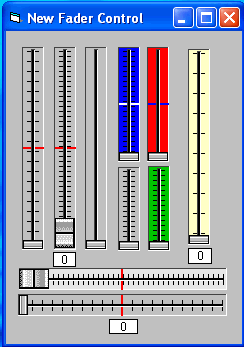



## Slider\_Mixer\_UserControl

### Description

The original author of this code is Mike Payne. I've just added and expanded his work. Added horizontal control and several more properties.
 
### More Info
 

             |
---                |---
**Submitted On**   |2008-02-23 13:38:14
**By**             |[Kenneth Foster](https://github.com/Planet-Source-Code/PSCIndex/blob/master/ByAuthor/kenneth-foster.md)
**Level**          |Intermediate
**User Rating**    |5.0 (10 globes from 2 users)
**Compatibility**  |VB 6\.0
**Category**       |[Custom Controls/ Forms/  Menus](https://github.com/Planet-Source-Code/PSCIndex/blob/master/ByCategory/custom-controls-forms-menus__1-4.md)
**World**          |[Visual Basic](https://github.com/Planet-Source-Code/PSCIndex/blob/master/ByWorld/visual-basic.md)
**Archive File**   |[Slider\_Mix2103122232008\.zip](https://github.com/Planet-Source-Code/kenneth-foster-slider-mixer-usercontrol__1-70133/archive/master.zip)

